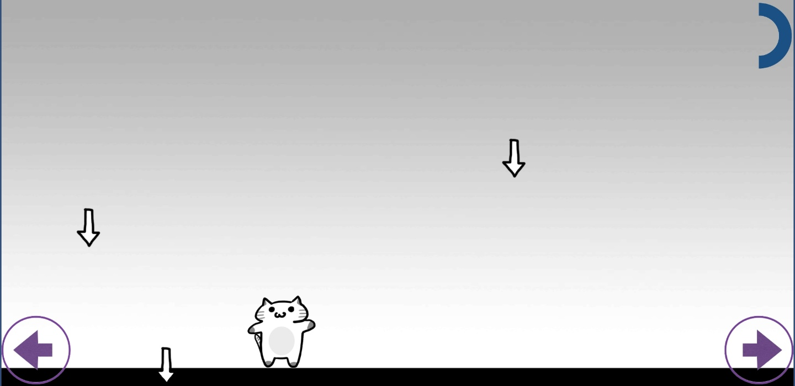

# Cat_Escape_Game
 
## 기획

- 주제 : 떨어지는 화살을 피하는 게임
- 내용 : 
    - 화살이 위에서 아래로 떨어짐
    - 좌우 화살표 버튼으로 플레이어 이동
    - HP 게이지가 화면 오른쪽 위에 표시됨
- 리소스 :
    1. 오브젝트 : 플레이어, 화살, 배경, 이동버튼, HP 게이지
    2. 컨트롤러 스크립트 : 플레이어 컨트롤러, 화살 컨트롤러
    3. 제네레이터 스크립트 : 화살 제네레이터(화살이 생성되는 공간)
    4. 감독 스크립트 : UI 갱신 감독
    5. 흐름 : 
        컨트롤러 -> 제네레이터 -> 감독

## 결과

- 버전1  
    